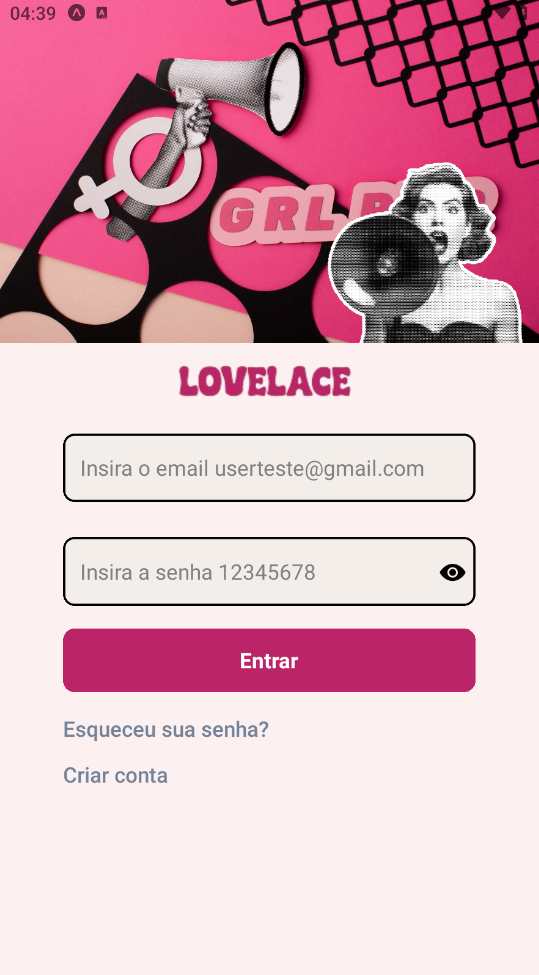
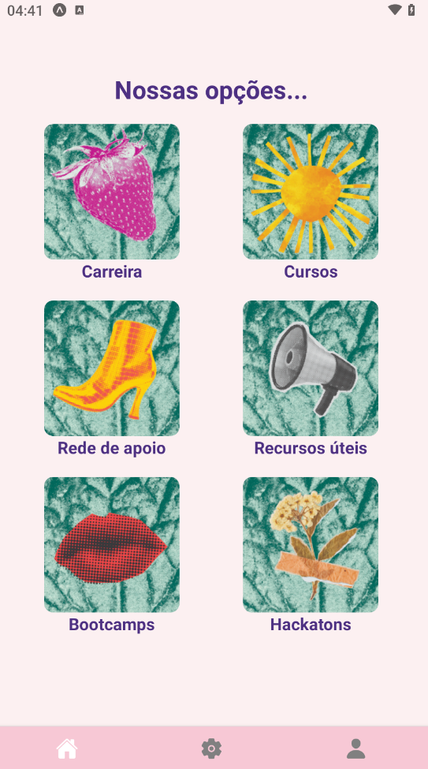

# Lovelace App
Um aplicativo interativo com um chatbot, que oferece um planejamento de carreira para mulheres que foram vítimas de violência e buscam uma rede de apoio para ingressar na área de tecnologia.

## Tecnologias Utilizadas
*React Native: Biblioteca JavaScript para construção de interfaces de usuário nativas para iOS e Android.

*Expo: Ferramenta para facilitar a criação e o desenvolvimento de aplicativos React Native.

*TypeScript: Superset do JavaScript que adiciona tipagem estática.

*React Hook Form: Biblioteca para gerenciamento de formulários em React.

## Instalação
### Clone o repositório

Instale as dependências através do  ``npm install``.

Baixe o Expo Go no seu dispositivo móvel (disponível na App Store e Google Play) ou configure um simulador móvel.

### Inicie o aplicativo:

```npx expo start --clear```
Escaneie o QR code com o aplicativo Expo Go ou pressione a tecla a no teclado para abrir no simulador Android ou IOS.

## Telas do APP

Login




Aviso caso o usuário insira a senha incorreta


Tela "quem somos nós"


Tela "nossas opções"




# Informações adicionais
Na tela "quem somos nós" passando o dedo para esquerda ou direta, é possível navegar entre as telas "nossas opções"
